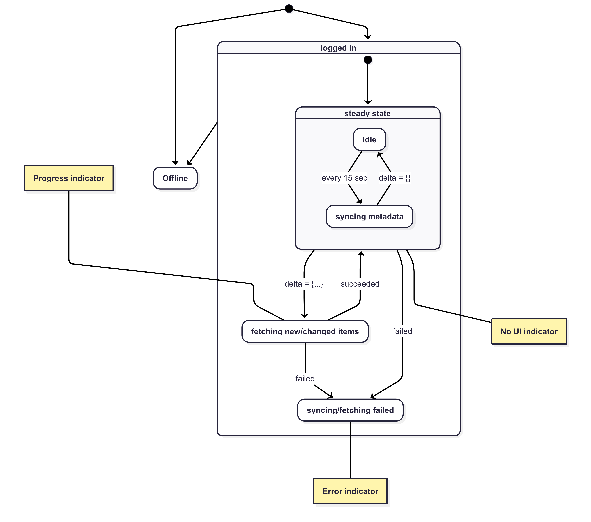

SecureDrop App Development
==========================

The SecureDrop App is a pre-alpha re-implementation of the SecureDrop Client for Qubes, built with modern web technologies.

The source code and issues are hosted on the `securedrop-client repository <https://github.com/freedomofpress/securedrop-client>`_ in the ``app`` directory.

.. warning::
   This project is not yet ready for production use. Please see the :doc:`client` documentation for the implementation currently in use in production.

Repository Overview
-------------------

The SecureDrop App is an Electron-based desktop application built with React and TypeScript. It provides a secure interface for SecureDrop journalists to communicate with sources, featuring a modern UI with Ant Design components and Tailwind CSS.

Requirements
~~~~~~~~~~~~

- Node.js (v22 or later)
- Rust toolchain (2021 edition or later)
- pnpm package manager
- Additional system packages for building the Rust proxy

Development Setup
-----------------

For complete setup instructions, development workflows, and available scripts, please refer to the `app directory README <https://github.com/freedomofpress/securedrop-client/blob/main/app/README.md>`_.

Synchronization Behavior
------------------------

.. note::
   The synchronization behavior described below represents the specification being implemented
   in both the new SecureDrop App and the v2 journalist API. This design addresses significant
   performance issues present in the legacy SecureDrop Client's synchronization approach.

The SecureDrop App maintains synchronization with the SecureDrop server through a combination of periodic metadata updates and content fetching. The following diagram illustrates the planned sync state machine:

Synchronization Overview
~~~~~~~~~~~~~~~~~~~~~~~~

**Syncing (Metadata Updates)**

Synchronization refers to one-directional metadata updates that bring the SecureDrop App up-to-date with information about source messages, journalist replies, and files on the SecureDrop server. This process determines what new content is available for download but does not include the actual message or file content.

The metadata synchronization includes:

- Source starring status
- Message and reply read status by journalists
- Journalist reply authorship information
- Source deletion status of replies (visible to journalists as "read by source" indicators)
- Timestamps of last source activity
- Journalist user account information for reply attribution

**Fetching (Content Download)**

Fetching encompasses the download and decryption of actual source messages and journalist replies. Messages are typically downloaded and decrypted immediately upon discovery to enable a chat-like user experience. Files, however, are never downloaded automatically and require explicit user action.

The server is the source of truth. Deletions on the server (a source the app knows about, but the server does not) trigger corresponding local deletions in the application.

Sync Loop Operation
~~~~~~~~~~~~~~~~~~~

The application implements a continuous sync loop to provide near real-time updates. By default, the application queries the server every 15 seconds when logged in. This interval balances responsiveness with server load considerations.

**Steady State Behavior**

Even on busy servers, most synchronization requests result in an empty delta (no changes), representing the steady state. During these periods, no user interface indicators are displayed for routine background syncing.

**Active Synchronization**

When the server reports changes (non-empty delta), the application transitions to active fetching:

- A progress indicator appears to inform users of ongoing download activity
- Messages and replies are downloaded and decrypted
- Local data is updated or deleted to match server state

The interface reflects new content once processing completes.

Online and Offline States
~~~~~~~~~~~~~~~~~~~~~~~~~~

**Offline Mode**

When not logged in or when server connectivity is unavailable, the application operates in offline mode. Users can still access previously synchronized messages, replies, and files stored locally. This design accounts for potential server downtime or Tor network connectivity issues.

**Online Transition**

Upon successful login, the application immediately initiates synchronization to catch up with any changes that occurred during the offline period.

Error Handling
~~~~~~~~~~~~~~

Synchronization failures are categorized as either recoverable or fatal. Some non-exhaustive examples:

**Recoverable Errors**

- Network connectivity issues
- Temporary Tor routing problems
- Transient server unavailability

The application may display error indicators, and will automatically retry these operations.

**Fatal Errors**

- Account deletion or suspension
- Incompatibility with the server (e.g., API mismatch)

These errors require user intervention and cannot be resolved through automatic retry mechanisms.

