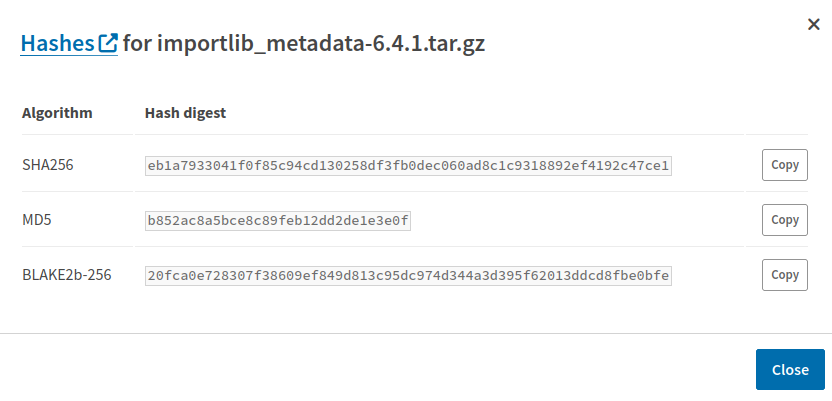

Dependency specification and update policies
============================================

This document describes the process for updating SecureDrop dependencies.
Since dependencies are run in the production environment, care should be
taken when adding or updating dependencies to minimize risk. The following
guidelines describe the process for adding or updating dependencies and
specifying supported version constraints. They should be followed by the PR
author or reviewer at the time of PR review.

Authors of PRs are encouraged to perform the investigations described below
when updating or adding dependencies, and post the results of their
investigation on the PR. Avoid if possible putting all the burden of dependency
review on the PR reviewer. Please note that the following guidelines do not
apply to dev, test, or deployment only (e.g. s3transfer, provided the
deployment artifacts are signed, which they should be) dependencies.

We use tools that pin every dependency to a specific version and verify they
match published checksums. Historically we used ``pip-compile`` for this
purpose; we are currently in the process of migrating to ``poetry``.

Adding a dependency
-------------------

Before a new dependency should be added, a review should be performed. The
following factors should be considered:

1. **Is this dependency well-maintained?** Are there recent commits or releases?
   Are high priority bugs on their bug tracker responded to and fixed?
2. **How secure is this dependency?** Have there been vulnerabilities reported
   in the project before? How have they responded? Do any of its dependencies
   have known CVEs? In lieu of a full code review (which might be a high burden),
   one might also run bandit static analysis on the Python dependency, are there
   high severity issues?
3. **How popular is this dependency?** How many GitHub stars does it have? Do
   other well-known projects depend on it? One can look at the GitHub dependency
   graph, e.g. Flask, in order to see the number of projects that use the
   dependency. By relying on well-known, widely-used dependencies, we benefit
   from the many eyes that should be evaluating it.

Updating dependencies
---------------------

When updating a dependency, one should:

1. **Review the changelog:** were any high-risk areas of the code modified? Were
   bugs with security implications fixed?
2. **Review the diff:** (If the dependency a major tool in the Python ecosystem,
   such as ``pip``, ``setuptools``, or ``wheel``, you can skip this step.) Perform a
   timeboxed review of the diff. Are there any concerning areas (primarily in
   terms of security)?  One can use the diffoscope tool from https://try.diffoscope.org/
   locally to view the diffs in the source code.
3. **Explain version specifiers:** Use comments in ``.in`` or ``pyproject.toml``
   files to explain why you are specifying certain versions or ranges.

dependabot automated updates
^^^^^^^^^^^^^^^^^^^^^^^^^^^^

GitHub's `dependabot <https://docs.github.com/en/code-security/dependabot/dependabot-alerts/about-dependabot-alerts>`_
can be used to automatically propose pull requests for dependency updates.

In addition to the normal review process, the reviewer should verify the
GitHub-provided checksums match those published for the package on `pypi.org <https://pypi.org/>`_.
To do so, locate the package on PyPI, select the correct version from the
"Release history" page, and click "Download files". Identify the files
corresponding to the Dependabot diff, and click "view hashes" to compare the
hashes.

You should see a dialog similar to this one:

   Example dialog for displaying hashes of a Python dependency published on PyPI

Specifying version constraints
------------------------------

For certain high-risk dependencies, we carefully control when and how far
they're updated. As a general rule, we don't want to accept major version
changes without substantial testing. For some projects, like Ansible before
it was semver-compatible, we only want to permit patch changes, not major or
minor. For example, in a ``requirements.in`` file:

.. code::

    # bad
    ansible>=2.9.13
    # good
    # v2.10.0 is a breaking change, requires custom update logic
    ansible>=2.9.13,<2.10.0

Make sure to provide a comment explaining the version constraints, so that
future maintainers will have an easier time making sense of the controls. If no
constraint is specified, then the latest version is assumed to be appropriate.
Typically, you should set a lower bound on the target version you just upgraded
to (for example, due to a ``safety`` alert):

.. code::

    Jinja2>=2.11.3

Doing so clearly indicates to other maintainers that no version less than
``2.11.3`` should be used. The next time the requirement is updated, the lower
bound should be adjusted accordingly.

For projects using poetry, the ``^`` semver operator should be used, which only
permits semver minor and patch updates:

.. code:: toml

    [tool.poetry.dependencies]
    sphinx = "^6.1.3"

Additional comments
^^^^^^^^^^^^^^^^^^^

These same processes should be followed for the dependencies of the dependency
highlighted in the diff.

Some package updates will require new reproducible wheels to be published in the
`securedrop-builder <https://github.com/freedomofpress/securedrop-builder>`_
repository; this should be done at the same time as the dependency update.

Dependency diff review procedure
--------------------------------

1. Download the source tarball from pypi.org for both the version from which
you are starting your diff review and the target version, example here for the
diff review for ``cryptography`` 2.3 to 2.7:

   .. code::

       $ pip download --no-binary :all: --no-deps cryptography==2.3
       $ pip download --no-binary :all: --no-deps cryptography==2.7

2. Compute the sha256 hashes:

   .. code::

       $ shasum -a 256 cryptography-{2.3,2.7}.tar.gz
       c132bab45d4bd0fff1d3fe294d92b0a6eb8404e93337b3127bdec9f21de117e6  cryptography-2.3.tar.gz
       e6347742ac8f35ded4a46ff835c60e68c22a536a8ae5c4422966d06946b6d4c6  cryptography-2.7.tar.gz

   Verify that these hashes match what's in the requirements file (before and after).

3. Now perform a timeboxed review of the diff using diffoscope or your tool of choice, e.g.:

   .. code::

       $ tar xvzf cryptography-2.3.tar.gz
       $ tar xvzf cryptography-2.7.tar.gz
       $ diff -r cryptography-2.3 cryptography-2.7 | more

   (Fun tip: use ``script`` to write ``diffoscope`` output to a file while
   preserving colors, and review at your leisure with ``less -R``.)

   If you find issues, discuss with other team members and escalate upstream where necessary.

4. Else, make a signed document containing the source tarball hashes before/after, and sign it:

   .. code::

    -----BEGIN PGP SIGNED MESSAGE-----
       Hash: SHA512

       Diff reviewed from:

       c132bab45d4bd0fff1d3fe294d92b0a6eb8404e93337b3127bdec9f21de117e6  cryptography-2.3.tar.gz
       e6347742ac8f35ded4a46ff835c60e68c22a536a8ae5c4422966d06946b6d4c6  cryptography-2.7.tar.gz
       -----BEGIN PGP SIGNATURE-----

       iQIzBAEBCgAdFiEEntsmvkbGwko38nhRsH6AZWrNlQEFAl1a9swACgkQsH6AZWrN
       lQGwbQ/+OwKgNKJuU44+zW8kBQ7l08oiLKf02kxBaGZYMBamd2/LMjATQGdQ8ocp
       sIQ4YXq+ybInv3ZNP8Ok9tuFP3o+3PsXU1Mc0A3FZnH4wwxFUGckWV57drFIWuSR
       pNOAO3M8VaggMP7FaDFgSRa1BmjBIYGW/FL+nUUSQtkFwOmGJEmVBo0Uxf8WXztP
       lnio4BYYsQbhjGSlm1jXjNyrMkHefYluKQBsjcgecU/dngTtOAD3GgAC6wczBztX
       k7Afzmv9vJVRIecZGkzfNNuJC5WCQjoH3y6DiyQYiIk9sIG0TbFnvqNIG2azWY5b
       AdlHgbsZqRO1tIMzjpn5fiiXHekJ8L8Y6tRTYGgkN9IIUAwwUhFkd0ExPB3OGOWz
       4CItkwyrfUC6RtwH0oGhHNUaDeGWrh3TyHwjHE9kFQDDz+RXvlSpBkLmZof/UK0V
       mK8TSs5LsA+WPTP8zbgjORcMmOZL44HdnrxnOpfM+YhBDKp8bUC2wB9Rasew74y6
       sM07lHyQQzDuPGvV/SrCVGJF8hDDA1OVLXK3QasEdHnvlU5w4lM8uLb+rX2sC8Im
       +HSpm3f4N7dbPTTft352+uSgD0vXGqzqwcOrovtEJcgb1T/IpN40QvnsrLQyMZ7O
       xPA9YoeZOlHsgAazDPXfHRqsPmJslZp80uZqbfp56OZPBBJKbuw=
       =T0MH
       -----END PGP SIGNATURE-----

   Note that you generate an inline signature like this via: ``gpg --clear-sign crypto-diff.txt``

5. At this point, create a wiki page e.g. https://github.com/freedomofpress/securedrop-debian-packaging/wiki/cryptography-2.3-to-2.7
   containing the hashes before/after.

6. Comment on the PR indicating that the diff review is approved.

7. Send the same content from the wiki to diff-review@python.org.
