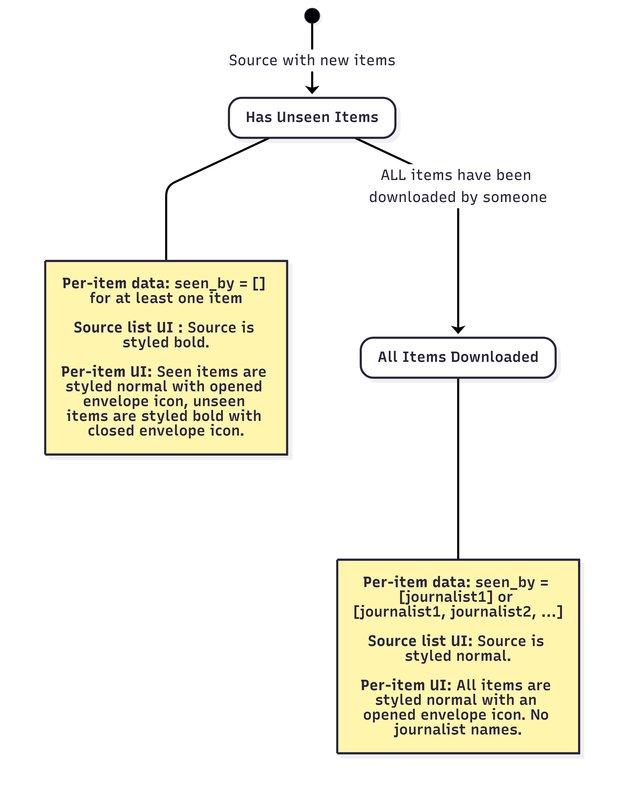
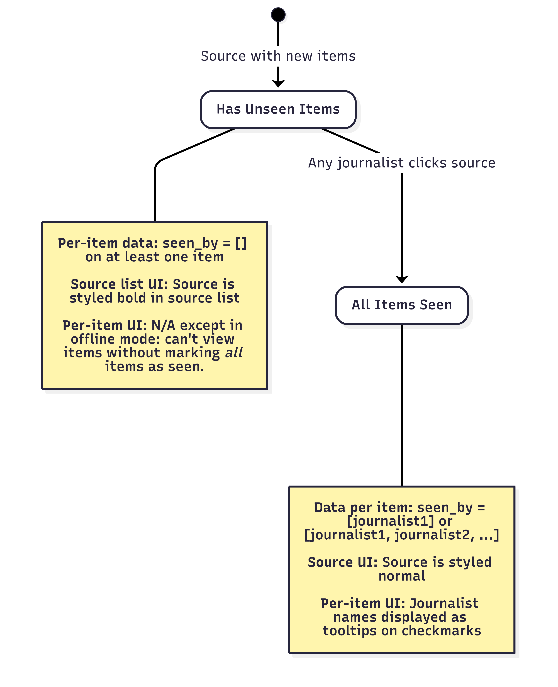

"Seen By" Feature
=================

The "seen by" feature tracks which journalists are aware of items associated with a source in SecureDrop's shared inbox model. This document describes the technical implementation and behavior across different SecureDrop interfaces.

Overview
--------

**Purpose**

The feature supports multi-journalist review of content by providing visibility into which team members have viewed specific items. This enables coordination and prevents duplicate work.

**Definitions**

- **Item**: A source message, submitted file, or journalist reply
- **Seen**: An item has been viewed by at least one journalist
- **Shared inbox model**: Source content appears as "new" until *any* journalist has seen it

Current Implementation
----------------------

The feature is currently implemented in the web-based *Journalist Interface* and in the Python/Qt-based SecureDrop Client.

The behavior is subtly different across these implementations, as summarized in the following table, and explained in more detail below.

+-------------------+---------------------------+-----------------------------------+
| Aspect            | Web Interface             | SecureDrop Client                 |
+===================+===========================+===================================+
| **Trigger**       | File download             | Source click (viewing             |
|                   |                           | conversation)                     |
+-------------------+---------------------------+-----------------------------------+
| **Granularity**   | Per-item as downloaded    | All source items at once          |
+-------------------+---------------------------+-----------------------------------+
| **Name Display**  | Not implemented           | Tooltip on checkmark per item     |
+-------------------+---------------------------+-----------------------------------+
| **Source Styling**| Bold for sources with     | Bold for sources with unseen      |
|                   | unseen items              | items                             |
+-------------------+---------------------------+-----------------------------------+

Journalist Interface Behavior
~~~~~~~~~~~~~~~~~~~~~~~~~~~~~

In the web-based Journalist Interface:

- **Trigger**: Item status is set to "seen" when downloaded by a journalist
- **Granularity**: Per-item basis (as files are downloaded)
- **Source List UI**: Sources with unseen items are styled bold in the source list
- **Per-Item UI**: Individual items are styled as bold (unseen) or normal (seen) with closed/opened envelope icons
- **Limitation**: Does not display which specific journalists have seen items

SecureDrop Client Behavior
~~~~~~~~~~~~~~~~~~~~~~~~~~~

In the Python/Qt-based SecureDrop Client:

- **Trigger**: All source items marked "seen" when conversation is viewed
- **Granularity**: All items in a conversation marked seen simultaneously
- **Source List UI**: Sources with unseen items are styled bold in the source list
- **Per-Item UI**: Journalist names displayed as tooltips on checkmarks for each item
- **Enhancement**: Shows specific journalist names who have seen each item

SecureDrop App Behavior
~~~~~~~~~~~~~~~~~~~~~~~

The implementation is being planned via `this tracking issue <https://github.com/freedomofpress/securedrop-client/issues/2618>`_.

State Flow Diagrams
-------------------

Journalist Interface State Flow
~~~~~~~~~~~~~~~~~~~~~~~~~~~~~~~

   A diagram showing how "seen" state is applied and displayed in the web-based *Journalist Interface* that is part of the SecureDrop Server.

SecureDrop Client State Flow
~~~~~~~~~~~~~~~~~~~~~~~~~~~~~

   A diagram showing how "seen" state is applied in the Python/Qt-based SecureDrop Client. Note that the entire conversation is marked as "seen" at once.

API Integration
---------------

The feature integrates with the ``/api/v1/seen`` endpoint. For complete API specification including request/response formats and error handling, see the :doc:`journalist_api` documentation.

Items marked as seen will include the journalist's UUID in the ``seen_by`` field of API responses. These UUIDs can be resolved to journalist names using the ``/api/v1/users`` endpoint.

Additional Implementation Considerations
----------------------------------------

**Special Cases**

- **Offline Mode**: SecureDrop Client displays "seen by" information but does not record new views
- **Deleted Users**: Displayed as "deleted" in SecureDrop Client tooltips
- **Own Replies**: Journalist's own replies are immediately marked as seen by the sending journalist—in other words, replying to to a source does not change the source's seen/unseen state (for any journalist, in any interface)

**Security Properties**

- Only tracks journalist viewing actions, never source actions
- Does not record file opening, only message/reply viewing
- Viewing status is available to all journalists