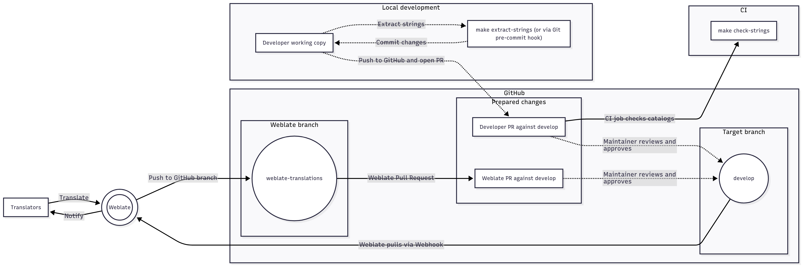

.. _Translations:

Translations
============

Quick Start Guide
-----------------

SecureDrop is a system that lets people share sensitive information
with investigative journalists anonymously and securely.
`Learn more about SecureDrop`_.

The SecureDrop Client is a component of the `SecureDrop Workstation`_, a new
tool to enable journalists to communicate with anonymous sources and manage
submitted documents via their SecureDrop, while providing mitigations against
malware and other security risks.  The Workstation and its components, including
the Client, are currently in a limited beta phase.

Both SecureDrop and the SecureDrop Client are written in English and translated
into multiple other languages. Translations are managed using **Weblate**,
a web platform that enables collaborative translation projects.

.. _getting_help_translations:

Getting help
^^^^^^^^^^^^

If you're interested in helping with translation and have questions
about anything in this document, here's how to ask for help:

* Chat in the `SecureDrop instant messaging channel`_

   * `Localization Lab`_, with whom we coordinate SecureDrop's translation, also
     maintains `their own channel <https://community.internetfreedomfestival.org/community/channels/localization-lab-chat>`_,
     hosted by the Internet Freedom Festival.

* Read the `Weblate documentation`_

.. _how_is_securedrop_translated:

How is SecureDrop translated?
^^^^^^^^^^^^^^^^^^^^^^^^^^^^^

SecureDrop is translated using the :ref:`Weblate platform. <get_started_using_weblate>`

Sources, journalists and admins use localized versions of SecureDrop. A malicious actor could attempt to modify their behavior by creating misleading translations. In order to mitigate that risk, all translations must be reviewed and accepted by designated :ref:`reviewers <weblate_glossary_reviewer>` before they become part of SecureDrop.

.. _when_is_securedrop_translated:

When does SecureDrop's translation happen?
^^^^^^^^^^^^^^^^^^^^^^^^^^^^^^^^^^^^^^^^^^

All of SecureDrop's :ref:`components <get_started_using_weblate>`
can be translated continuously, as new code and
:ref:`source strings <weblate_glossary_source_string>`
are merged into the project. Translations are then finalized during
the release process.

This process is coordinated in collaboration with `Localization Lab`_.  You
can watch for the announcements published in :ref:`multiple locations
<getting_help_translations>`.

Workflow Diagram
^^^^^^^^^^^^^^^^



   A workflow diagram showing the continuous translations process.


.. _translation_responsibilities:

Translation Responsibilities
^^^^^^^^^^^^^^^^^^^^^^^^^^^^

1. **Developers** must use ``make extract-strings`` to keep the
   catalog template up to date with changes they've
   made to UI strings in the Python source code. Developers are
   encouraged to commit ``make extract-strings`` changes *along with*
   the source-code changes that caused them, for a cleaner Git history
   to review and (if necessary) ``blame`` and ``revert``.

    * CI will enforce this requirement via ``make check-strings`` on
      branches pushed to this repository.  Like the other linters,
      this check must pass for a pull request to be approved for
      merge into ``main``.

    * Developers can run ``make check-strings`` locally.

2. **Maintainers** should keep in mind that pull requests they
   review will include changes to the catalog template
   for any strings changed in the source code. They should consider
   the impact and timing of these changes on translators---just as
   they consider the impact and timing of code changes on other
   developers---as part of their review of a pull request prior to
   approving it for merge into ``main`` and thereby into Weblate.

3. **Translators** can always see the latest strings available to
   translate in `weblate`_. They can translate new and
   changed strings continuously, as development progresses, and
   they can give feedback on strings well in advance of the release
   period.

4. **Release and localization managers** do not need to do anything special
   outside of preflight testing! As summarized above, developers are
   responsible for keeping strings up to date; Weblate is responsible for
   keeping the per-language editable ``.po`` catalogs and loadable ``.mo`` machine
   objects up to date.

Tutorial for Developers
^^^^^^^^^^^^^^^^^^^^^^^

Let's say you've made the following string change in the Client's
Python source code::

	$ git diff
	diff --git a/securedrop_client/app.py b/securedrop_client/app.py
	index 6b95eda..13ee15d 100644
	--- a/securedrop_client/app.py
	+++ b/securedrop_client/app.py
	@@ -175,7 +175,7 @@ def prevent_second_instance(app: QApplication, unique_name: str) -> None:
		 if e.errno == ALREADY_BOUND_ERRNO:
		     err_dialog = QMessageBox()
		     err_dialog.setText(
	-                _("{application_name} is already running").format(
	+                _("{application_name} is already running!").format(
		             application_name=app.applicationName()
		         )
		     )

When you commit and push this change, you'll receive the following error in CI::


	writing PO template file to securedrop_client/locale/messages.pot
	Translation catalog is out of date. Please run "make extract-strings" and commit the changes.
	make: *** [check-strings] Error 1

As prompted, run ``make extract-strings`` and commit and push the changes::

	$ make extract-strings
	[...]
	writing PO template file to securedrop_client/locale/messages.pot
	$ git diff
	diff --git a/securedrop_client/app.py b/securedrop_client/app.py
	index 6b95eda..13ee15d 100644
	--- a/securedrop_client/app.py
	+++ b/securedrop_client/app.py
	@@ -175,7 +175,7 @@ def prevent_second_instance(app: QApplication, unique_name: str) -> None:
		     if e.errno == ALREADY_BOUND_ERRNO:
		         err_dialog = QMessageBox()
		         err_dialog.setText(
	-                _("{application_name} is already running").format(
	+                _("{application_name} is already running!").format(
		                 application_name=app.applicationName()
		             )
		         )
	diff --git a/securedrop_client/locale/messages.pot b/securedrop_client/locale/messages.pot
	index 51c95cc..524cdde 100644
	--- a/securedrop_client/locale/messages.pot
	+++ b/securedrop_client/locale/messages.pot
	@@ -16,7 +16,7 @@ msgstr ""
	 "Content-Transfer-Encoding: 8bit\n"
	 "Generated-By: Babel 2.9.1\n"
	 
	-msgid "{application_name} is already running"
	+msgid "{application_name} is already running!"
	 msgstr ""
	 
	 msgid "The SecureDrop server cannot be reached. Trying to reconnect..."
	$ git commit --all --message "changes a string"
	[i18n 3637b3d] changes a string
	 2 files changed, 2 insertions(+), 2 deletions(-)

When you open a pull request for your branch, a maintainer will review your
string changes for their translation impact.


Weblate
-------

.. _get_started_using_weblate:

Get started using Weblate
^^^^^^^^^^^^^^^^^^^^^^^^^

You can choose to :ref:`register on Weblate <how_to_register_on_weblate_email>`
with your email address, or by linking a GitHub account.

You can contribute to any language, and Weblate has some conveniences
to make it easier to work with your preferred languages.
Learn :ref:`how to choose your preferred languages on Weblate <how_to_manage_your_preferred_languages_weblate>`.

Our Weblate instance only contains one project, SecureDrop, which has
four translation components:

#. **SecureDrop:**  The main SecureDrop web application.
#. **desktop:**  The translations for the desktop icons of the admin
   and journalist workstations used by news organizations.
#. **SecureDrop Glossary:**  Weblate's internal :ref:`glossary
   <weblate_glossary>` for SecureDrop terms.
#. **SecureDrop Client:**  The SecureDrop Client interface of the `SecureDrop
   Workstation`_.

.. figure:: images/weblate/project.png
   :align: center
   :figwidth: 80%
   :width: 100%

   Components of the SecureDrop project in Weblate. Click on the image to see it full-size.

Once a string is translated, it must be approved by a :ref:`reviewer <weblate_glossary_reviewer>`
before being accepted into SecureDrop.

Approved strings can only be modified by reviewers.
However, translators can still suggest modifications and make comments
if they notice something wrong.
SecureDrop translations are a collaborative endeavour!

Learn :ref:`how to translate SecureDrop using Weblate <how_to_translate_a_language_weblate>`.

.. _how_to_register_on_weblate_email:

How to register an account on Weblate using an email address
^^^^^^^^^^^^^^^^^^^^^^^^^^^^^^^^^^^^^^^^^^^^^^^^^^^^^^^^^^^^

#. Visit the `Weblate registration page`_.
#. Fill the form **Register using email** and click **Register**.
#. Check your email for a message from **weblate@securedrop.org** with the subject **[Weblate] Your registration on Weblate**.
#. That message contains a confirmation link. Click that link to complete your registration.

.. figure:: images/weblate/registration.png
   :align: center
   :figwidth: 80%
   :width: 100%

   Weblate registration page. Click on the image to see it full-size.

.. _how_to_register_on_weblate_github:

How to register an account on Weblate using a GitHub account
^^^^^^^^^^^^^^^^^^^^^^^^^^^^^^^^^^^^^^^^^^^^^^^^^^^^^^^^^^^^

#. Visit the `Weblate registration page`_.
#. Click on the GitHub icon, under **Third party registration**.
#. Log into GitHub if necessary.
#. Click the green **Authorize freedomofpress** button.

The authorization request looks like this:

.. figure:: images/weblate/github-authorization.png
   :align: center
   :figwidth: 50%
   :width: 100%

   GitHub authorization request. Click on the image to see it full-size.

.. _how_to_manage_your_preferred_languages_weblate:

How to manage your preferred languages on Weblate
^^^^^^^^^^^^^^^^^^^^^^^^^^^^^^^^^^^^^^^^^^^^^^^^^

#. Visit the `Weblate dashboard`_.
#. Click the **Manage your languages** button.
#. Select the languages your want to translate.
#. Click the **Save** button.

.. figure:: images/weblate/manage-languages.png
   :align: center
   :figwidth: 80%
   :width: 100%

   Language preferences in Weblate. Click on the image to see it full-size.

.. _how_to_translate_a_language_weblate:

How to translate a language on Weblate
^^^^^^^^^^^^^^^^^^^^^^^^^^^^^^^^^^^^^^

#. Visit the `Weblate dashboard`_.
#. Click on the **component** in order to display the list of languages in which it is translated.
#. Click the **Translate** button.
#. :ref:`Start translating <how_to_translate_a_phrase_weblate>`.

.. figure:: images/weblate/translations.png
   :align: center
   :figwidth: 80%
   :width: 100%

   List of available languages in Weblate. Click on the image to see it full-size.
   
.. _how_to_translate_a_phrase_weblate:

How to translate a phrase on Weblate
^^^^^^^^^^^^^^^^^^^^^^^^^^^^^^^^^^^^

#. :ref:`Select a language <how_to_translate_a_language_weblate>`.
#. Read the translatable string in the text area labelled **Source**.
#. Review the suggested translations if there are any in the **Glossary** sidebar.
#. Review the contextual information about the :ref:`source string <weblate_glossary_source_string>`
   in the **Source information** sidebar, like its location in our source code.
#. If a screenshot of the SecureDrop user interface is available, read the *source string* in context.

   * For SecureDrop, you can also use `SecureDrop's demo server`_ to preview the
     source string in context.
   * For the (beta) SecureDrop Client, consult the screenshots published with
     the `SecureDrop Workstation documentation`_.  Feel free to :ref:`contact
     the SecureDrop team <getting_help_translations>` with any questions or
     feedback.

#. Input your translation in the **Translation** test area near the *source string*.
#. Click **Save**. The next untranslated string will appear automatically.

.. figure:: images/weblate/translate.png
   :align: center
   :figwidth: 80%
   :width: 100%

   Translating a phrase in Weblate. Click on the image to see it full-size.

- :ref:`Learn more about translating phrases with placeholders <how_to_translate_a_phrase_with_placeholders>`
- :ref:`Learn more about translating phrases with HTML code <how_to_translate_a_phrase_with_html_code>`
- :ref:`Learn more about using language glossaries on Weblate <how_to_use_language_glossaries_on_weblate>`
- :ref:`Learn more about using SecureDrop's demo server <how_to_use_securedrop_demo_server>`

.. _how_to_use_language_glossaries_on_weblate:

How to use the language glossaries on Weblate
^^^^^^^^^^^^^^^^^^^^^^^^^^^^^^^^^^^^^^^^^^^^^

Weblate contains an internal glossary for each language, to which
we can add suggested translations. If a :ref:`source string <weblate_glossary_source_string>` contains terms
from this glossary, the glossary entries will be displayed in a box on
the right side of the translation page.

.. figure:: images/weblate/glossary-sidebar.png
   :align: center
   :figwidth: 80%
   :width: 100%

   Glossary sidebar in Weblate. Click on the image to see it full-size.

If you find that a *source string* contains terms from the
`SecureDrop glossary <https://docs.securedrop.org/en/stable/glossary.html>`_ or the
`EFF Surveillance Self-Defense glossary`_, but the glossary sidebar says
``No related strings found in the glossary.``,
we'd really appreciate it if you could add those terms to
the glossary of the language you're working with.


.. _weblate_glossary:

Glossary
^^^^^^^^

Weblate contains an internal glossary for each language, to which
we can add suggested translations. Learn more about
:ref:`using language glossaries on Weblate <how_to_use_language_glossaries_on_weblate>`.

.. figure:: images/weblate/glossary-list.png
   :align: center
   :figwidth: 80%
   :width: 100%

   A language glossary in Weblate. Click on the image to see it full-size.

If a term is missing from the glossary for the language
you're translating into, you can refer to the following
technical glossaries for additional context. Then you can contribute
to improving your own language glossary on Weblate by suggesting
a translation yourself!

- The `SecureDrop glossary <https://docs.securedrop.org/en/stable/glossary.html>`_ explains terms specific to SecureDrop
- The `EFF Surveillance Self-Defense glossary`_ explains many general
  security concepts

Additionally, here is a list of terms that are specific to the usage of Weblate for SecureDrop.

.. _weblate_glossary_reviewer:

Reviewer
""""""""

Reviewers are people who are trusted to review and accept new translations into SecureDrop.
Learn :ref:`how to become a reviewer <how_to_become_a_reviewer>`.

.. _weblate_glossary_source_string:

Source string
"""""""""""""

On Weblate, the phrases being translated are called *source strings*. (No relation with the terms *source* and *journalist* in SecureDrop.)

Source strings are English phrases and are automatically extracted from SecureDrop's code. Because of that, they can only be modified by developers outside Weblate. Learn :ref:`how to suggest changes to a source string <how_to_suggest_changes_to_a_source_string>`.


How-To Guides
-------------

.. _how_to_suggest_changes_to_a_source_string:

How to suggest changes to a source string
^^^^^^^^^^^^^^^^^^^^^^^^^^^^^^^^^^^^^^^^^

If you notice errors in our :ref:`source strings <weblate_glossary_source_string>`,
or catch us using English idioms that are hard to translate,
please add comments letting us know. We appreciate your feedback very much
and our release schedule includes a few days at the beginning
of every translation cycle for incorporating it.

.. _how_to_use_securedrop_demo_server:

How to use SecureDrop's demo server
^^^^^^^^^^^^^^^^^^^^^^^^^^^^^^^^^^^

The demo server always showcases the latest release candidate of SecureDrop.

Unlike a real SecureDrop instance, you can access the demo server using any
web browser.

You can use it to review new *source strings* in the context in which either
a *source*, or a *journalist* would read them. Those two experiences are called
the *Source Interface* and the *Journalist Interface*.

In order to review the demo server as a *source*:

#. Visit `SecureDrop's demo server`_.
#. Click on the "Source Interface" link.

In order to review the demo server as a *journalist*:

#. Visit `SecureDrop's demo server`_.
#. Take note of the **username**, **passphrase** and **current TOTP token**
   at the bottom of the page; you will need them to log in.
#. Click on the "Journalist Interface" link.
#. Input the **username**, **passphrase** and **current TOTP token**
   ("Two-factor Code") to log in.

.. _`SecureDrop's demo server`: https://demo.securedrop.org

.. _how_to_become_a_reviewer:

How to become a reviewer
^^^^^^^^^^^^^^^^^^^^^^^^

`Contact Localization Lab`_ to ask to join a `language team`_ as a reviewer.

.. _how_to_add_a_new_language:

How to add a new language to SecureDrop
^^^^^^^^^^^^^^^^^^^^^^^^^^^^^^^^^^^^^^^

We love seeing SecureDrop translated into new languages.  `Contact Localization
Lab`_ to ask to join a `language team`_ (or start a new one) and have the new
language added to Weblate.

However, SecureDrop only supports a subset of all the languages being worked on
in `Weblate`_.   New languages are supported according to the
:doc:`supported_languages`.


.. _how_to_change_an_existing_translation:

How to change an existing translation
^^^^^^^^^^^^^^^^^^^^^^^^^^^^^^^^^^^^^

If you think a translation can be improved, please don't run roughshod
over another translator's work. Make a suggestion or comment first, to
allow for discussion before saving your changes.

Exceptions to this policy would be:

- Obvious errors in spelling, grammar, or punctuation

- A string in our interface that is supposed to match another
  project. For example, we include instructions for adjusting Tor
  Browser settings, so if our wording is out of date, it has to be
  corrected to reduce confusion for people using SecureDrop.

In those cases, please feel free to correct the existing translation.

.. _how_to_translate_a_phrase_with_placeholders:

How to translate a phrase with placeholders
^^^^^^^^^^^^^^^^^^^^^^^^^^^^^^^^^^^^^^^^^^^

Source strings may contain placeholder text in curly braces, for
example ``{count}``. These represent variable content (like a
username, as in the example below), and must be left unmodified, but
they can be moved around in a string. For instance::

  Edit user {user}

might be displayed to the user as::

  Edit user Jean-Claude

The French translated string should look like::

  Modifier l'utilisateur {user}

And it would be **incorrect** to translate the placeholder like so::

  Modifier l'utilisateur {utilisateur}

.. _how_to_translate_a_phrase_with_html_code:

How to translate a phrase with HTML code
^^^^^^^^^^^^^^^^^^^^^^^^^^^^^^^^^^^^^^^^

Some :ref:`source strings <weblate_glossary_source_string>` represent HTML that will be presented in the
SecureDrop web interface.

HTML elements (embraced by in ``<``, ``>``, example: ``<strong>``)
can contain multiple so-called *attributes*.

The text of the two attributes called ``alt`` and ``title``
should be translated. The text of the other attributes should not
be translated.

Attribute ``alt``
"""""""""""""""""

Image elements (````) in HTML place a picture on the
page. Because people with visual impairments rely on a special note
on the image element -- the ``alt`` attribute -- to describe the image,
it is necessary to translate those. Here's an example that contains an
image with both an ``alt`` attribute *and* a placeholder::

  

As explained above, the placeholder ``{icon}`` in the ``src``
attribute of the ```` element should not be translated. The
``alt`` attribute text (``"shield icon"``) should be. The correctly
translated HTML in Portuguese would be::

  

Attribute ``title``
"""""""""""""""""""

Links (``<a>``) and abbreviations (``<abbr>``) sometimes rely on
an additional ``title`` attribute. The content of that attribute is
usually shown when placing a cursor over the link or abbreviation.
::

  <a id="recommend-tor" title="How to install Tor Browser" href="{url}">Learn how to install it</a>

It is necessary to translate the contents of any ``title`` attribute.
The correctly translated HTML in Spanish would be::

  <a id="recommend-tor" title="Cómo instalar Tor Browser" href="{url}">Aprenda cómo instalarlo</a>

As explained above, the text content ``recommend-tor`` of the ``id``
attribute in the ``<a>`` element should not be translated. Neither
should the ``{url}`` placeholder of ``href`` attribute. Only the text
content of the ``title`` attribute (``"How to install Tor Browser"``)
should be translated.

Other attributes
""""""""""""""""

No attribute other than ``alt`` and ``title`` should be translated.

In particular, please make sure the attributes ``class``, ``id``,
``height``, ``href``, ``rel``, ``src`` and ``width``
are never translated.

.. _`Learn more about SecureDrop`: https://docs.securedrop.org/en/stable/what_is_securedrop.html
.. _`Weblate`: https://weblate.org/
.. _`SecureDrop Weblate instance`: https://weblate.securedrop.org/
.. _`Weblate registration page`: https://weblate.securedrop.org/accounts/register/
.. _`Weblate dashboard`: https://weblate.securedrop.org/
.. _`SecureDrop instant messaging channel`: https://gitter.im/freedomofpress/securedrop
.. _`Weblate documentation`: https://docs.weblate.org/
.. _`EFF Surveillance Self-Defense glossary`: https://ssd.eff.org/en/glossary/
.. _`SecureDrop Workstation`: https://workstation.securedrop.org
.. _`SecureDrop Workstation documentation`: https://workstation.securedrop.org
.. _`Localization Lab`: https://www.localizationlab.org/
.. _`Contact Localization Lab`: https://wiki.localizationlab.org/index.php/Communication_Platforms
.. _`language team`: https://wiki.localizationlab.org/index.php/Category:Language_Teams
